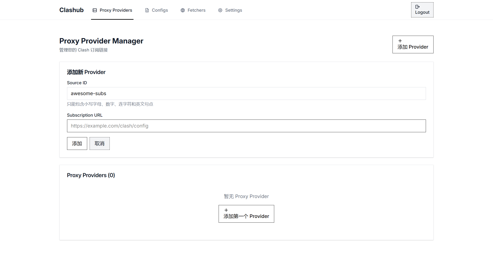

# Clashub

Your configuration center for Clash. Built with Cloudflare.

## Screenshot

## Features

- 提取 Proxy Providers
- 自动识别 Clash/Mihomo YAML、Base64、SIP008/SSD 和常见代理 URI 订阅
- 在多个 Clash 客户端之间同步配置文件
- 适用于 Rule Providers 的反向代理

### Proxy Provider 订阅格式

Proxy Provider 会自动处理以下上游内容：

- 完整 Clash/Mihomo YAML、仅含 `proxies` 的 Provider YAML，以及等价 JSON
- 标准或 URL-safe Base64 编码的 YAML、JSON、代理 URI 列表
- SIP008 与 SSD Shadowsocks 订阅
- SS、SSR、VMess、VLESS、Trojan、Hysteria、Hysteria2、TUIC、AnyTLS、HTTP 和 SOCKS URI

YAML 中的 Mihomo 节点会原样保留，因此不受上述 URI 协议列表限制。无法可靠转换的 URI 协议会返回明确错误，不会静默丢弃节点。

每个 Proxy Provider 还可以配置节点名称匹配正则与替换模板。正则默认全局匹配并区分大小写；替换模板支持 JavaScript `String.replace` 的 `$1`、`$2`、`$&`、`$<name>` 和 `$$` 占位符。例如使用 `^(.*?) - (.*)$` 与 `$1 · $2` 可以统一节点名称分隔符。

## Quickstart

1. 部署到 Cloudflare

   

2. 访问站点，设置 Token
